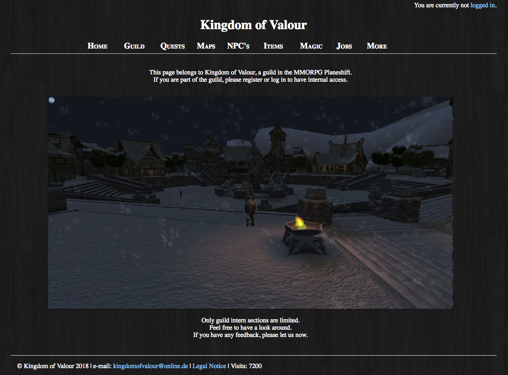

# Planeshift

This repository contains a `database` containing informations about the game _PlaneShift_. It also contains the `source code` needed to properly display the database. The database has been collected by members of the in game group _Kingdom of Valour_ and therefore has been published under it’s label. The running website with all it’s information can be found at [kingdomofvalour.de](www.kingdomofvalour.de).

## Code

The displayed website is written in `xhtml` and `css`. The data is stored in a `mySQL` database and accessed using `PHP`. Most of the data is organized offline in `Java` except the registered members’ datatable which is purly stored in the online database.

## The Game

PlaneShift is a Role Playing Game immersed into a 3D virtual fantasy world, completely made and maintained by volunteers! Passionate RPG gamers gathered to create an open and freely available game. There are no surprises of premium content which will limit your gameplay or unbalance the game. PlaneShift is [Open Source](https://www.planeshift.it/Source%20code) for the client and server code.

## Preview

